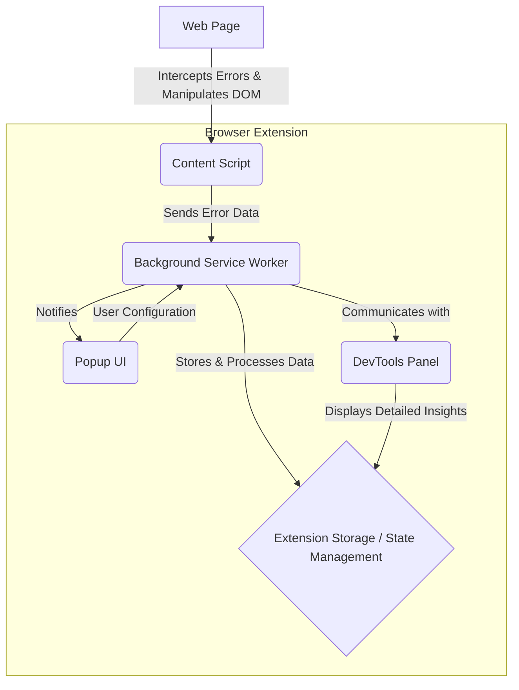

<p align="center">
  
</p>

<h1 align="center">JSErrorFlow-RealTime-Visualizer-Browser-Extension</h1>

<p align="center">
  <!-- Build Status -->
  
  <!-- Coverage (Placeholder) -->
  
  <!-- Tech Stack -->
  
  <!-- Linter -->
  
  <!-- License -->
  
  <!-- Version -->
  
  <!-- GitHub Stars -->
  <a href="https://github.com/YourOrg/JSErrorFlow-RealTime-Visualizer-Browser-Extension/stargazers">
    
  </a>
</p>

<p align="center">
  <b>Star ⭐ this Repo to support our mission in elite frontend debugging!</b>
</p>

<p align="center">
  An elite, real-time browser extension engineered to precisely pinpoint and visually highlight JavaScript errors directly on associated DOM elements. This critical debugging tool dramatically streamlines frontend development workflows, significantly boosts developer productivity, and delivers immediate, intuitive visual feedback within any web environment.
</p>

--- 

## 🚀 Project Overview

JSErrorFlow is the ultimate browser extension for real-time JavaScript error visualization. By injecting directly into the web page context, it identifies runtime errors and dynamically overlays visual cues and detailed information onto the exact DOM elements involved, transforming error detection from a tedious console hunt into an intuitive visual experience. This tool is indispensable for accelerating debugging cycles and maintaining high-quality web applications.

## 📊 Architecture

JSErrorFlow employs a robust architecture designed for efficient, real-time error processing and DOM manipulation within the browser extension paradigm. It leverages distinct components for content script injection, background service worker management, and intuitive user interface presentation.



## 📝 Table of Contents

- [🚀 Project Overview](#🚀-project-overview)
- [📊 Architecture](#📊-architecture)
- [📝 Table of Contents](#📝-table-of-contents)
- [🤖 AI Agent Directives](#🤖-ai-agent-directives)
- [🛠️ Local Development Setup](#🛠️-local-development-setup)
- [⚙️ Available Scripts](#⚙️-available-scripts)
- [🏗️ Core Development Principles](#🏗️-core-development-principles)
- [🤝 Contributing](#🤝-contributing)
- [🛡️ Security](#🛡️-security)
- [📜 License](#📜-license)

## 🤖 AI Agent Directives

<details>
<summary><b>Expand for AI System Configuration & Architectural Guidance</b></summary>

### Tech Stack Definition

This project is an advanced browser extension built with the following core technologies, optimized for performance, maintainability, and developer experience:

*   **Frontend Framework:** WXT (Web Extensibility Toolkit) for streamlined cross-browser extension development.
*   **Language:** **TypeScript 6.x** (Strict Mode enforced).
*   **Bundler/Dev Server:** **Vite 7** (leveraging Rolldown for optimized bundling).
*   **State Management:** **Signals** (standardized for reactive and performant state handling).
*   **Styling:** TailwindCSS v4 for utility-first styling.
*   **Linting & Formatting:** **Biome** (chosen for its exceptional speed and integrated linter/formatter capabilities).
*   **Unit Testing:** **Vitest** (fast, Vite-native testing framework).
*   **End-to-End Testing:** **Playwright** (for robust, cross-browser E2E testing of extension functionality).

### Architectural Patterns

The codebase adheres to the following foundational architectural principles:

*   **Feature-Sliced Design (FSD):** Organized into `app`, `pages`, `widgets`, `features`, `entities`, `shared` layers to ensure strict module boundaries, high cohesion, and low coupling. This promotes scalability and reusability.
*   **SOLID Principles:** Strict adherence to Single Responsibility, Open/Closed, Liskov Substitution, Interface Segregation, and Dependency Inversion Principles throughout the codebase.
*   **DRY (Don't Repeat Yourself):** Emphasis on abstracting common logic and components to minimize redundancy.
*   **Separation of Concerns:** Clear distinction between UI components, business logic, data fetching, and browser API interactions.
*   **Command Query Responsibility Segregation (CQRS):** Logic is explicitly divided into commands (mutating state) and queries (reading state) to enhance clarity and maintainability.

### Key Verification Commands for AI Agents

To ensure the integrity and quality of the codebase, AI agents should execute the following commands:

*   **Install Dependencies:** `npm install` or `pnpm install` or `yarn install` (prefer `pnpm` if available).
*   **Run Development Server:** `npm run dev` (starts the Vite dev server for extension).
*   **Build Production Bundle:** `npm run build`
*   **Lint & Format Check:** `npm run lint` or `biome check --apply .` (for strict adherence to style).
*   **Run Unit Tests:** `npm run test` or `vitest run`
*   **Run E2E Tests:** `npm run test:e2e` or `playwright test`
*   **Type Check:** `npm run type-check` or `tsc --noEmit`

**Mandate:** All automated checks (`lint`, `test`, `type-check`) must pass with zero errors before any code commit or integration.
</details>

## 🛠️ Local Development Setup

To get JSErrorFlow up and running on your local machine, follow these steps:

### Prerequisites

*   Node.js (LTS version recommended)
*   npm, yarn, or pnpm (pnpm is recommended for faster installs and better disk space utilization)

### Installation

1.  **Clone the repository:**

    ```bash
    git clone https://github.com/YourOrg/JSErrorFlow-RealTime-Visualizer-Browser-Extension.git
    cd JSErrorFlow-RealTime-Visualizer-Browser-Extension
    ```

2.  **Install dependencies:**

    ```bash
    # Using pnpm (recommended)
    pnpm install

    # Or using npm
    # npm install

    # Or using yarn
    # yarn install
    ```

3.  **Start the development server:**

    ```bash
    pnpm dev
    ```

    This will build the extension and watch for changes. The output will provide instructions on how to load the unpacked extension in your browser (e.g., Chrome, Firefox).

4.  **Load the extension in your browser:**

    *   **Chrome:** Go to `chrome://extensions/`, enable "Developer mode", click "Load unpacked", and select the `dist` folder generated by `pnpm dev`.
    *   **Firefox:** Go to `about:debugging#/runtime/this-firefox`, click "Load Temporary Add-on...", and select any file inside the `dist` folder.

## ⚙️ Available Scripts

In the project directory, you can run:

| Command            | Description                                                               |
| :----------------- | :------------------------------------------------------------------------ |
| `pnpm dev`         | Starts the development server with hot-reloading for the extension.       |
| `pnpm build`       | Builds the extension for production to the `dist` folder.                 |
| `pnpm lint`        | Runs Biome linter and formatter to check and fix code style issues.       |
| `pnpm test`        | Runs unit tests using Vitest.                                             |
| `pnpm test:e2e`    | Runs end-to-end tests using Playwright.                                   |
| `pnpm type-check`  | Performs TypeScript type checking across the project.                     |
| `pnpm format`      | Applies Biome formatting rules to the entire codebase.                    |
| `pnpm clean`       | Removes build artifacts and temporary files.                              |

## 🏗️ Core Development Principles

Our development philosophy for JSErrorFlow is rooted in modern, robust engineering practices:

*   **SOLID:** Adhering to the Single Responsibility, Open/Closed, Liskov Substitution, Interface Segregation, and Dependency Inversion principles ensures a highly maintainable and scalable codebase.
*   **DRY (Don't Repeat Yourself):** We strive to eliminate redundant code by creating reusable abstractions and utilities.
*   **KISS (Keep It Simple, Stupid):** Solutions are designed to be as straightforward as possible, avoiding unnecessary complexity.
*   **YAGNI (You Aren't Gonna Need It):** Features are implemented only when they are genuinely required, preventing over-engineering.
*   **Test-Driven Development (TDD):** Writing tests before code helps ensure functionality, improves design, and reduces bugs.
*   **Code Review:** All changes undergo rigorous peer review to maintain quality and share knowledge.

## 🤝 Contributing

We welcome contributions to JSErrorFlow! Please see our [CONTRIBUTING.md](.github/CONTRIBUTING.md) for guidelines on how to submit issues, features, and pull requests.

## 🛡️ Security

Your security is our priority. Please refer to our [SECURITY.md](.github/SECURITY.md) to learn how to report vulnerabilities and understand our security practices.

## 📜 License

This project is licensed under the [Creative Commons Attribution-NonCommercial (CC BY-NC) License](LICENSE).
